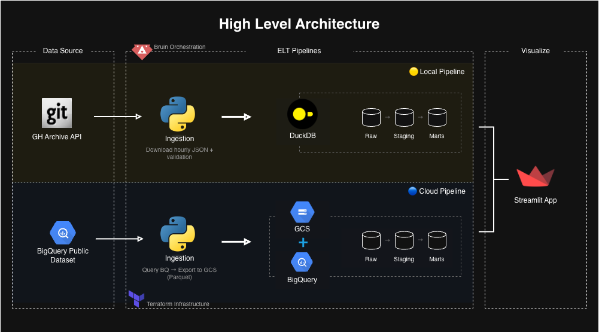

# GH Archive Analytics Pipeline
## Table of Contents
- [Overview](#overview)
- [Tech Stack](#tech-stack)
- [Architecture and Modeling Approach](#architecture-and-modeling-approach)
    - [Local Pipeline](#-local-pipeline)
    - [Cloud Pipeline](#-cloud-pipeline)
    - [Checks and Validation](#checks-and-validation)
- [Dashboard](#dashboard)
- [Key Design Decision](#key-design-decision)
- [How to Reproduce](#how-to-reproduce)
- [Selected Repos](#selected-repos)


## Overview
This project builds a complete data workflow to analyze GitHub activity using the [GH Archive dataset](https://www.gharchive.org/). It ingests GitHub event data and transforms it into analytical tables, which are then visualized in an interactive Streamlit dashboard.

The project includes two pipelines based on storage backend:

- **Local pipeline** (`gharchive-local`) | DuckDB → 🟡
    - Use case: fast iteration, debugging transformations, dashboard development.
- **Cloud pipeline** (`gharchive-cloud`) | GCS + BigQuery → 🔵
    - Use case: scheduled execution, production-like setup.


> [!NOTE]
> The cloud pipeline supports both local execution (for development/testing) and cloud execution (for scheduled runs).

> [!NOTE]
> The project is designed to be reproducible in both local and cloud setups and to support the same analytical use case across both.


\
This project demonstrates:
- End-to-end batch pipeline design
- Local and cloud reproducibility
- Data lake + warehouse architecture
- SQL-based transformations
- Idempotent ingestion patterns
- Data quality checks
- Local and cloud orchestration
- Dashboarding on top of analytics marts

## Tech Stack
- Orchestration: **Bruin**
- Local Warehouse: **DuckDB**
- Cloud Warehouse: **BigQuery**
- Data Lake: **Google Cloud Storage (GCS)**
- Transformation: **SQL**
- Language: **Python**
- Visualization: **Streamlit**
- Infrastructure: **Terraform**


## Architecture and Modeling Approach
Although similar, each execution mode has their own architecture. Both models filter to a [set of data engineering / analytics repositories](#selected-repos).




### 🟡 Local Pipeline

#### Ingestion
- Python asset orchestrated with Bruin
- Downloads hourly GH Archive `.json.gz` files directly from GH Archive
- Maintains a rolling 7-day local window
- Handles:
  - retries
  - partial downloads
  - skipping existing files
  - cleanup of old files outside the rolling window

#### Data Storage
- Local DuckDB database
- Raw files stored in `data/raw/`

#### Data Model
- Raw Layer
    - Direct ingestion of JSON data
    - Handles schema drift using `union_by_name`[^1] and a full schema scan with `sample_size = -1`[^2]
- Staging Layer
  - Flattens nested JSON fields
  - Renames columns
  - Deduplicates events
  - Produces a cleaner event-level table
- Mart layer
  - Builds aggregated tables by repo, event type, and actor

> [!NOTE]
> The local pipeline intentionally keeps a fixed 7-day rolling window instead of storing the full history locally. This keeps local development faster, lighter, and aligned with the dashboard use case.

### 🔵 Cloud Pipeline

#### Ingestion
- Python asset orchestrated with Bruin
- Reads from BigQuery public dataset: `githubarchive.day.*`
- Exports that day to GCS in Parquet Format
- Keep all the data in GCS
- Supports safe reruns by overwriting the exported day if needed

#### Data Storage
- Raw data stored in GCS
- Analytical tables stored in BigQuery

#### Data Model
- Raw Layer
  - BigQuery external table reads Parquet files from GCS
  - Data is loaded into partitioned BigQuery tables
  - Daily loads are idempotent through delete + reload of the target day
- Staging Layer
    - Flattens fields
    - Renames columns
    - Deduplicates events
- Mart Layer
  - Builds aggregated tables by repo, event type, and actor


### Checks and Validation
The project uses custom SQL checks across layers[^3]:

- **Raw**: basic integrity checks
- **Staging**: structural and transformation checks
- **Marts**: aggregation and business logic validation

> [!IMPORTANT]
> Some checks, such as enforcing `repo_name IS NOT NULL` in staging, were intentionally not used because the source data can legitimately contain nulls.


## Dashboard 
The Streamlit dashboard supports both data sources. It includes:

- KPI cards
- Daily activity over time
- Event type distribution
- Top repos / top contributors
- Repo filter (`All repos` or a specific repo)


The dashboard reads from marts rather than raw tables to keep the UI logic simpler and the queries lighter.


## Key Design Decision
### ▫️Two independent pipelines instead of one heavily parameterized pipeline
Instead of a single parameterized pipeline, there are 2 independent pipelines (`gharcihve-local`, `gharchive-cloud`). This avoids excessive conditional logic, keeps dependencies simpler, and makes each setup easier to reason about and debug.

### ▫️Same cloud pipeline, different execution environments
The cloud pipeline can run:

- locally, for development and testing
- in the cloud, for scheduled execution

This keeps the cloud logic consistent across environments and reduces the risk of “dev vs prod” drift.

### ▫️Daily ingestion based on the previous UTC day
The pipeline processes one complete UTC day at a time, using the previous day as the data target.

This avoids:

- partial-day loads
- time-of-run inconsistencies
- different results depending on whether the pipeline was triggered locally or in the cloud

It also makes daily reruns and backfills safer.

### ▫️Idempotent daily loading
The project favors rerunnable daily loads:

- **Local**
  - maintains a rolling 7-day local window
  - old local files outside the window are removed
- **Cloud**
  - overwrites exported GCS files for the target day
  - deletes and reloads the target partition in BigQuery

This makes reruns and backfills simpler and more predictable.

### ▫️Terraform for reproducible cloud infrastructure

Terraform is used to provision the main cloud resources required by the project, including:

- the GCS bucket used as the lake layer
- the BigQuery dataset used as the warehouse layer

This keeps the infrastructure reproducible and reduces manual setup.

### ▫️Mart loading strategy

| Table | Strategy | Reason |
| --- | --- | --- |
| `mart_repo_daily_activity` | Incremental (daily partition reload / merge) | Time-series aggregate by day; efficient to update one target day at a time |
| `mart_repo_daily_event_type_activity` | Incremental (daily partition reload / merge) | Same pattern as daily activity; naturally aligned with daily ingestion |
| `mart_repo_actor_activity` | Full rebuild | Depends on activity across the full available history/window; simpler and safer to recompute |
| `mart_repo_summary` | Full rebuild | Small summary table; full rebuild keeps logic simple and correctness easy to verify |


### ▫️Unified Streamlit app
A single Streamlit application supports both DuckDB (local) and BigQuery (cloud) as data sources. This avoids duplicating dashboard logic and ensures consistent metrics and visualizations across environments. It also enables seamless switching between local development and cloud data without modifying the UI layer.

## How to Reproduce
Both execution modes run "yesterday" by default.

### Clone the repository
```
git clone https://github.com/roxannardgz/gh-archive
cd gh-archive
```

### Set up the environment
Ths project uses `uv`.
```
uv venv
source .venv/bin/activate
uv sync
```

<details>

<summary>🟡 Local Mode</summary>
Use this mode when you want the fastest feedback loop for development, debugging, and dashboard work.

### Requirements
- Python environment set up with uv
- DuckDB dependencies installed through the project environment


### Run pipeline
You can use the helper script:
```
./scripts/run_local.sh
```

Or run the assets directly with Bruin:
```
bruin run pipeline/assets/local/*.py pipeline/assets/local/*.sql
```

What it does
- Downloads hourly GH Archive files into `data/raw/`
- Loads and transforms the data in DuckDB
- Builds staging and mart tables
- Keeps a rolling 7-day local window


</details>


<details>

<summary>🔵 Cloud Mode (Local Execution)</summary>

Use this mode when you want to test the cloud pipeline locally before scheduling it.

### Requirements
- Python environment set up with uv
- GCP credentials configured
- BigQuery access
- GCS access
- Cloud resources created
    - GCS bucket
    - BigQuery dataset

 ### Provision cloud resources
Terraform is used to provision the main cloud resources for the project.

Edit the `terraform.tfvars` file to update the project ID

From the Terraform directory:
```
terraform init
terraform plan
terraform apply
```
This provisions the cloud storage and warehouse resources used by the cloud pipeline.

### Authenticate with GCP

You need valid Google Cloud credentials before running the cloud pipeline locally.

A common local setup is:
gcloud auth application-default login
gcloud auth application-default set-quota-project <your-gcp-project-id>

### Run the cloud pipeline locally
You can use the helper script:
```
./scripts/run_cloud.sh
```

Or run the assets directly with Bruin:
```
bruin run pipeline/assets/cloud/*.py pipeline/assets/cloud/*.sql
```

What it does
- Reads one UTC day from the public GitHub Archive source in BigQuery
- Exports that day to GCS as Parquet
- Loads the raw layer into BigQuery
- Runs staging and mart transformations in BigQuery

</details>

<details>
<summary>🔵 Cloud Mode (Bruin Cloud)</summary>

Use this mode for scheduled execution.

### Requirements
- Repository pushed to GitHub
- Bruin Cloud project configured
- Google Cloud credentials / connection configured in Bruin Cloud
- Required cloud resources already provisioned

### Typical setup flow
- Push the repository to GitHub
- Connect the repository in Bruin Cloud
- Configure the required Google Cloud connection
- Trigger a manual run to validate the setup
- Enable the schedule

The pipeline is designed to run daily and process the previous UTC day.

</details>

### Run the dashboard
```
uv run streamlit run dashboard/streamlit_app.py
```
The select the correct data source in the dashboard sidebar.


## Selected Repos
The project focuses on a curated set of 15 data engineering / analytics repositories:

- `apache/airflow`
- `ClickHouse/ClickHouse`
- `metabase/metabase`
- `apache/superset`
- `airbytehq/airbyte`
- `apache/spark`
- `trinodb/trino`
- `duckdb/duckdb`
- `dbt-labs/dbt-core`
- `dagster-io/dagster`
- `PrefectHQ/prefect`
- `apache/flink`
- `DataTalksClub/data-engineering-zoomcamp`
- `kestra-io/kestra`
- `bruin-data/bruin`

> [!NOTE]
> This list can be changed. To analyze a different set of repositories, update the filtering logic in the asset that creates `stg_selected_events`.


<!--
## 🧪 Backfilling
```
bruin run \
  --start-date 2026-03-25T00:00:00Z \
  --end-date 2026-03-31T23:59:59Z \
  pipeline/assets/cloud/*.py \
  pipeline/assets/cloud/*.sql
```
-->


[^1]: `union_by_name` helps handle schema drift when reading multiple JSON files whose fields are not perfectly aligned. DuckDB aligns columns by name and fills missing values with nulls where needed.

[^2]: `sample_size = -1` forces a full scan during schema inference instead of sampling only part of the data. This helps detect fields that appear only in a small subset of records.

[^3]: Custom SQL checks were used instead of relying on built-in checks because the cloud pipeline uses fully qualified BigQuery table references, and custom checks gave more control across environments.
