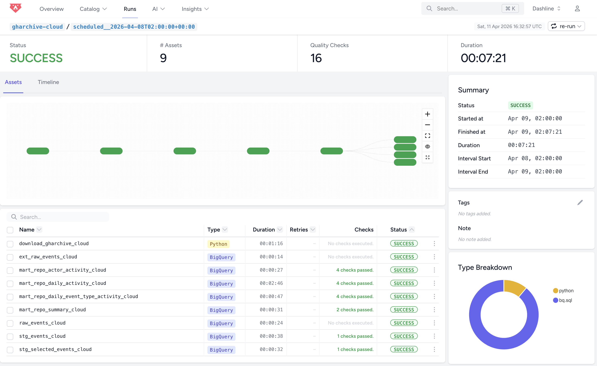

# Peer Review Guide

This document helps reviewers quickly evaluate this project against the official criteria.
Each section explains where to find the relevant implementation and why it meets the requirements.

## 1. Problem Description 

Summary: The GH Archive dataset contains large volumes of raw GitHub event data that are difficult to query and analyze directly. This project builds a data pipeline to transform this raw data into structured, aggregated tables, enabling efficient analysis of repository activity through a dashboard.

It also demonstrates how the same pipeline can run both locally and in the cloud.

It also demonstrates how the same pipeline can run both locally and in the cloud. Key challenges addressed:

- How to process large-scale event data efficiently
- How to design pipelines that work both locally and in the cloud
- How to provide fast analytics through pre-aggregated tables and a dashboard

📍 See: 
- [README.md](/README.md#overview) → Overview

## 2. Cloud

The cloud mode of the pipeline is fully implemented in the cloud using:
- GCS (data lake)
- BigQuery (data warehouse)

\
Infrastructure is provisioned using Terraform (IaC), ensuring reproducibility and consistency across environments:
- GCS bucket
- BigQuery dataset

📍 See:
- [README.md](/README.md#-cloud-pipeline) → Architecture and Modeling Approach → Cloud Pipeline
- [terraform/](/terraform/)

## 3. Data Ingestion & Orchestration (Batch)

The project uses Bruin for workflow orchestration.

The pipeline:
- Downloads (local) or extracts (cloud) raw data
- Loads into storage (DuckDB or BigQuery)
- Runs transformations (staging + marts)

All steps are orchestrated through Bruin assets:

- Python ingestion assets
- SQL transformation assets

This forms an end-to-end pipeline, not manual steps.

📍 See:
- [pipelines/local/assets/](/pipelines/local/assets/)
- [pipelines/cloud/assets/](/pipelines/cloud/assets/)
- [pipeline.yml for local pipeline](/pipelines/local/pipeline.yml)
- [pipeline.yml for cloud pipeline](/pipelines/cloud/pipeline.yml)

## 4. Data Warehouse

BigQuery is used as the cloud data warehouse.

Tables are:

- partitioned by date (event_date / created_at)
- designed for time-based queries used in the dashboard

📍 See:
- [pipelines/cloud/assets/*.sql](/pipelines/cloud/assets/)
- [README.md](/README.md#architecture-and-modeling-approach) → Architecture and Modeling Approach

## 5. Transformations 

Transformations are implemented using SQL in Bruin assets.

They include:
- Staging Layer:
    - Flattens nested JSON fields
    - Renames columns
    - Deduplicates events
    - Produces a cleaner event-level table
- Marts:
    - Builds aggregated tables by repo, event type, and actor

  
📍 See:
- [pipelines/local/assets/](/pipelines/local/assets/)
- [pipelines/cloud/assets/](/pipelines/cloud/assets/)
- [README.md](/README.md#architecture-and-modeling-approach) → Architecture and Modeling Approach

## 6. Dashboard

The dashboard includes multiple visual components (more than two tiles), satisfying the dashboard requirement.

- KPI cards
- Activity over time
- Event type distribution
- Top repositories / contributors
- Repo filter

Supports both:

- DuckDB (local pipeline)
- BigQuery (cloud pipeline)

📍 See:

- [dashboard/streamlit_app.py](/dashboard/streamlit_app.py)
- [README.md](/README.md#dashboard) → Dashboard

## 7. Reproducibility

The project includes complete and tested instructions to reproduce the pipeline end-to-end:

- Environment setup (uv)
- Local pipeline execution
- Cloud pipeline execution (local + scheduled)
- Infrastructure provisioning (Terraform)
- Authentication (gcloud)
- Dashboard usage
- Backfilling

📍 See:
- [README.md](/README.md#how-to-reproduce) → How to Reproduce

## Summary

This project demonstrates:
- End-to-end batch data pipeline
- Cloud implementation with IaC
- Optimized data warehouse design
- Multiple dashboard visualizations
- Full reproducibility